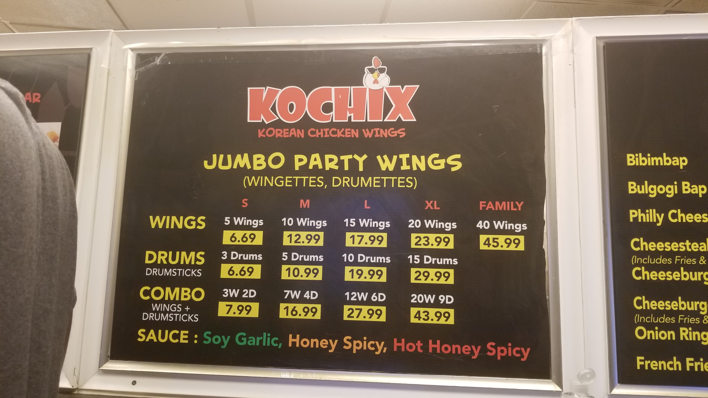

---
# This is the YAML header/metadata for the document
title: "Fried Chicken - Intro to Data Science overview"
author: "Edwin Lo, GWU"
# date: "today"
date: "`r Sys.Date()`" 
# this style requires installing rmdformats package 
output:  
    rmdformats::readthedown:
      toc_float: true
      toc_depth: 3
      number_sections: true
      code_folding: hide
      includes:
        before_body: header.html
---

```{r init, include=F}
# The package "ezids" (EZ Intro to Data Science) includes a lot of the helper functions we developed for the course. 
# Some of the frequently used functions are loadPkg(), xkabledply(), xkablesummary(), uzscale(), etc.
# Once installed, load the library.
library(ezids)
```


```{r setup, include=FALSE}
# some of common options (and the defaults) are: 
# include=T, eval=T, echo=T, results='hide'/'asis'/'markup',..., collapse=F, warning=T, message=T, error=T, cache=T, fig.width=6, fig.height=4, fig.dim=c(6,4) #inches, fig.align='left'/'center','right', 
# knitr::opts_chunk$set(warning = F, results = "markup", message = F)
knitr::opts_chunk$set(warning = F, results = "hide", message = F)
# knitr::opts_chunk$set(include = F)
# knitr::opts_chunk$set(echo = TRUE)
options(scientific=T, digits = 3) 
# options(scipen=9, digits = 3) 
# ‘scipen’: integer. A penalty to be applied when deciding to print numeric values in fixed or exponential notation.  Positive values bias towards fixed and negative towards scientific notation: fixed notation will be preferred unless it is more than ‘scipen’ digits wider.
# use scipen=999 to prevent scientific notation at all times
```

# Fried Chicken Pricing
## The beginning

At a [yelp-highly-rated](https://www.yelp.com) chicken place one summer, 
I was waiting for my order, which took **forever** (exaggerated). 
Without any other better things to do, I re-studied the menu there, trying to understand the pricing structure. See photo:  
 

I was wondering to myself tons of questions: how can I get the best deal? What is the cost per wing, and cost per drum? Does the restaurant use a formula to determine the pricing? 

Bugger! "I am *cursed*. Shouldn't have come here. I might not get out of here alive..." I thought at the time.  

You can see the set prices in the photo. We will need to re-format our data, from this *wide* format (often in pivot and summary tables), to a flat, *long* format here. Let us practice our Markdown skill at the same time to tabulate them:    

Wings | Drums | Price   
-----|-------|-----------  
 5   |   0   |  6.69   
10   |   0   | 12.99   
15   |   0   | 17.99   
20   |   0   | 23.99   
40   |   0   | 45.99   
 0   |   3   |  6.69   
 0   |   5   | 10.99  
 0   |  10   | 19.99   
 0   |  15   | 29.99   
 3   |   2   |  7.99   
 7   |   4   | 16.99   
12   |   6   | 27.99   
20   |   9   | 43.99   
  

Let us now enter these as a dataframe in R.


```{r init_data, results='asis'}
# korean-fried-chicken-wing pricing
kfcw <- data.frame(wing=c(-5,10,15,20,40,0,0,0,0,3,7,12,20), drum=c(0,0,0,0,0,3,5,10,15,2,4,6,9), price=c(6.69,12.99,17.99,23.99,45.99,6.69,10.99,19.99,29.99,7.99,16.99,27.99,43.99) )
xkabledply(kfcw) 
```

So there are `r length(kfcw$wing)` data points in our dataset. (Notice the use of inline R codes here.)

## Exploratory Data Analysis (EDA)
There are a bit of things we typically look at for EDA.

1. Basic statistics
    + mean, s.d., median, range (four spaces at the start of line for proper sub-list indentation)
1. Simple correlations and tests
    + correlation matrix if applicable
    + z-test, t-test, anova test if applicable
    + chi-squared test if applicable
1. Normality
    + QQ-plot
    + boxplot
    + histogram 
    + Shapiro-Wilk test
    + ...

### Basic statistics
```{r EDA_basicstats, results="asis"}
# str(kfcw)
# summary(kfcw)
xkablesummary(kfcw) # better display than the line above
```

When I ran this the first time, the minimum number of wings is **negative 5**. That's obviously a mistake. Have an action plan to fix such non-sensible or missing values. For me, it's just getting some more coffee. 
After I fixed it, re-run the EDA, and all looks good now.

```{r EDA_rerun, results='asis'}
kfcw[1,1]=5  # equal sign "=" and assignment operator "<-" are interchangeable in R
# structure of the data frame kfcw
# str(kfcw)
# summary(kfcw)
xkablesummary(kfcw) # better display than the line above
```

### Tests (Correlation, ANOVA, ...)
Since the features/variables are all numerical (quantitative), it makes most sense to check their linear correlations.

```{r corr, echo=TRUE, message=F}
loadPkg("corrplot")
corrmatrix = cor(kfcw)  # more detailed pair-wise correlation test can be obtained from cor.test(kfcw$wing,kfcw$price) etc
corrplot.mixed(corrmatrix, 
               title="Correlation Matrix for Chicken Meal Price",
               mar=c(0,0,1,0) # fixes the position of title
               )
```

It is good to see that price has a decent correlation with both wing and drum, with wing seems to have a higher correlation. It is also great that drum and wing do not have too strong a correlation between them. Imagine if each drum I buy, I always will be thrown with 2 dog bones, I will have a hard time knowing if I am really paying for the drum or the dog bones. This is called a problem of collinearity. (We'll check with VIF.)

### Normality check/test
It is usually best if all the variables (numerical ones) are normally distributed. This usually does not happen, but we would still like to know overall the distribution is bell-shaped, and not too awkward. 

#### QQ-plot
We can first check the QQ-plots for each variable by itself. A straight line means normal distribution.
```{r normality_qqplot, echo=T}
qqnorm(kfcw$price, main = "Price Q-Q Plot", ylab="Price Quantiles ($)") 
qqline(kfcw$price)
qqnorm(kfcw$wing, main = "Wing Q-Q Plot", ylab="Wing-count Quantiles") 
qqline(kfcw$wing)
qqnorm(kfcw$drum, main = "Drum Q-Q Plot", ylab="Drum-count Quantiles") 
qqline(kfcw$drum)
```

The data values are not close to normal distribution, but with only `r length(kfcw$wing)` data points, that is expected, and it's probably okay.

#### Boxplot
Next we can check the boxplots for a rough visual.
```{r normality_boxplot, echo=T}
# We will learn to use the more powerful ggplot soon, instead of this generic boxplot function
boxplot(kfcw, col=c("red","blue","green"), ylab="count or price($)", main="Boxplots for the three variables")
axis(side = 4)
```

Same conclusion: they do not look like normal, but we'll take it.

#### Histogram
Now histograms:
```{r normality_histogram, echo=T}
# We will learn to use the more powerful ggplot soon, instead of this generic hist function for histograms
barcolors = c("green", "violet", "orange", "blue", "pink", "red", "yellow", "cyan")
hist(kfcw$price, main = "Histogram for Price distribution", xlab="Price ($)", col=barcolors, breaks = 10)
hist(kfcw$wing, main = "Histogram for Wing-count", xlab="Wing Count", col=barcolors, breaks = 6)
hist(kfcw$drum, main = "Histogram for Drum-count", xlab="Drum Count", col=barcolors, breaks = 6)
```

#### Shapiro-Wilk test
And finally, using shapiro-wilk test:
```{r normality_shapiro_wilk}
priceshapiro = shapiro.test(kfcw$price)
wingshapiro = shapiro.test(kfcw$wing)
drumshapiro = shapiro.test(kfcw$drum)
```
The Shapiro-Wilk test p-value on `price` is `r round(priceshapiro$p.value, 4)`.  
The Shapiro-Wilk test p-value on `wing` is `r round(wingshapiro$p.value, 4)`.  
The Shapiro-Wilk test p-value on `drum` is `r round(drumshapiro$p.value, 4)`.  
We'll learn to interpret these soon.


## Linear Model

Now if those passed the smell test, we can try build some models. Linear model is first to come to mind. We will model the price with wing and drum as the two independent variables (also called features).

```{r linear_model, results=T}
# build a simple linear model (least square fit) of price as a function of everything else.
chicklm = lm(price ~ ., data=kfcw)
# summary(chicklm)
xkabledply(chicklm, title = "Summary of linear model for Chicken Meals")
```

As we can see, the R$^2$ (using $\LaTeX$ formatting here) value of the linear model is `r format(summary(chicklm)$r.squared, digits=4)`, which shows the prices are set with rather strict per-piece-structure. 

If we use the (default 95%) confidence intervals of the coefficients as shown here:

```{r confint.lm, results='asis'}
coeffconfint = confint.lm(chicklm) 
# coeffconfint
xkabledply(coeffconfint, title = "Coefficient Confidence Intervals (CI) at 95%") # display better than the line above
```

### Findings
We find that:

1. Each piece of wing cost about \$`r format(coeffconfint[2,1], digits=3)` to \$`r format(coeffconfint[2,2], digits=3)`
2. Each piece of drum stick cost about \$`r format(coeffconfint[3,1], digits=3)` to \$`r format(coeffconfint[3,2], digits=3)`
1. The intercept of about \$`r format(coeffconfint[1,1], digits=3)` to \$`r format(coeffconfint[1,2], digits=3)`, or average of \$`r format(chicklm$coefficients[1], digits=2)` probably represent the base per-order or box/bag charge.

Check:   
We should always check for multi-collinearity in linear models. Here are the **Variance Inflation factors VIF**.  

```{r linearmodel_vif, results='asis'}
loadPkg("faraway") # faraway library is one of them has a vif function
# VIF check the collinearity issues between different variables/features in a (linear) model
# vif(chicklm)
xkablevif(chicklm, title="Chicken Model VIFs")  # better display than the line above
# unloadPkg("faraway")
```
With VIF values less than 5, we can safely conclude there is not much collinearity concerns in the dataset. 

### Plot 3D
Visual is always king in data science. Let's get a bit fancy.

```{r 3dscatter2, echo=T}
loadPkg("plot3D")
# reference from http://www.sthda.com/english/wiki/impressive-package-for-3d-and-4d-graph-r-software-and-data-visualization
# x, y, z variables
x <- kfcw$wing
y <- kfcw$drum
z <- kfcw$price
# Compute the linear regression (z = ax + by + d)
# chicklm <- lm(z ~ x + y)
# predict values on regular xy grid
grid.lines = 20
x.pred <- seq(min(x), max(x), length.out = grid.lines)
y.pred <- seq(min(y), max(y), length.out = grid.lines)
xy <- expand.grid( wing = x.pred, drum =y.pred)
z.pred <- matrix(predict.lm(chicklm, newdata = xy), nrow = grid.lines, ncol = grid.lines)
# fitted points for droplines to surface
fitpoints <- predict.lm(chicklm)
# scatter plot with regression plane
scatter3D(x, y, z, pch = 18, cex = 2, theta = 5, phi = 20, ticktype = "detailed", xlab = "wing", ylab = "drum", zlab = "price",  surf = list(x = x.pred, y = y.pred, z = z.pred, facets = NA, fit = fitpoints), main = "Chicken Price Analysis")

```

# Conclusion
So what is the best deal???

## First bite

Let me compare the predicted values from the model with the actual values. In other words, look at the residual values.
```{r residual, results=T, echo=T}
kfcw$fitval = chicklm$fitted.values
kfcw$residuals = chicklm$residuals
# kfcw
xkabledply(kfcw, title = "Data values and residuals") # better display than the line above
```

Ah, the residual is most negative with the 40-wing combo at -\$1.31. That saves me a can of soda. I should go for that and kill myself. 

But if I am wiser, and insist on having a one-person portion: 

1. 5-piece wing is at +\$0.10 (paying a dime too much!) - Not good. 
1. 3-piece drum is at -\$0.12, saving a dozen pennies, sounds good.
1. The 3-wing-2-drum deal (at -\$0.30) is the best value for me! 

## Double dip
Hold on! If we plan to do this regularly, shouldn't we inspect the percentage savings instead? 

```{r residualpercent, results=T, echo=T}
kfcw$res_2_p = chicklm$residuals/kfcw$price*100
# kfcw
xkabledply(kfcw, title = "Revised Data values and residuals") # better display than the line above
```

The new metric here tells me: 

1. The 10-drum deal at -4.5% is best percentage-wise. 
1. The 3-wing-2-drum deal at -3.76% is next. 

To me, putting all these different metrics and criteria together, the 3-wing-2-drum is my winner.

**Case closed. Mic dropped.**

## Confession

Oh wait... I forgot that I am a pescatarian (vegetarian and fish) for over a decade! I just have these cravings for wings once in a while.
What if I add a sin-ful parameter as a penalty term, how much should I order next time to minimize my sin (Root-Mean-Squared-Sinfulness).

To be continued...

But yes, the wings there were really really good. Totally worth the wait.

# Reference 

APA Style preferred

1. Yelp
1. Google
1. My wallet
